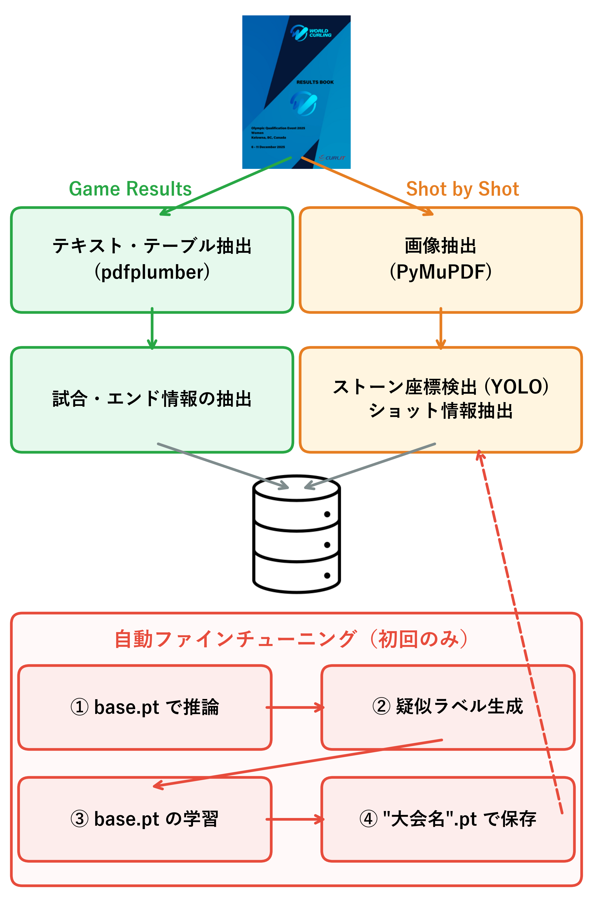

# ResultsBook2DB

[CURLIT](https://curlit.com/) 社が提供するカーリングの公式記録集 (Results Book) から試合データを抽出し、SQLite データベースに保存するツールです。

## 特徴

* **PDF 解析**: Result Book (PDF形式) を読み込み、大会情報・試合情報・エンド情報・ショット情報・ストーン配置情報を自動抽出します。
* **ストーン検出**: 各大会に自動適応したYOLO モデルを使用して、Shot by Shot 画像からストーン配置の座標を検出します。初めて取得する大会の場合、ベースとなるモデル(`base.pt`)を用いて疑似ラベルを生成し、ファインチューニングを行います。学習後の重みは`大会名.pt`というファイルで保存されます。
* **データベース保存**: 抽出したデータを構造化された SQLite データベース (`.db`) に保存します。

## 処理フロー (System Flow)

## 必要要件

* Python 3.12+ (動作確認済み)
* パッケージマネージャー `uv`
* 推奨環境: GPU搭載 PC

## ダウンロードと実行

### Windows 版

GitHub の [Releases](https://github.com/szmrki/ResultsBook2DB/releases) から最新の実行ファイル（`.7z`）をダウンロードできます。

* **GPUについて**: 配布版は CUDA 12.8 用です。認識されない場合は [BUILD_GUIDE.md](BUILD_GUIDE.md) を参照しビルドしてください。

### macOS / Linux 版

[BUILD_GUIDE.md](BUILD_GUIDE.md) を参照してビルドしてください。

## 使用方法

1. **起動**: ダウンロードまたはビルドした `RB2DB.exe` (Linux/macOS の場合は `RB2DB`) を起動します。
2. **データベース設定**: 既存のデータベースファイル (`.db`) に追記するか、新規作成するかを選択します。
3. **PDFファイルの登録**: ダウンロードした Results Book (PDF) を入力します。複数ファイルの同時登録に対応しています。
4. **モード選択と実行**: 対象大会が「4人制」か「ミックスダブルス (MD)」かを選択し、「解析を開始」ボタンをクリックします。

> [!WARNING]
> 4人制と MD では一部の処理やデータ構造が異なるため、**必ず別々のデータベースファイルに保存してください。**

## データベース構造

SQLite データベース (`.db`) は以下のテーブルで構成されています。

### `events` (大会情報)

| カラム名 | 説明 |
| :--- | :--- |
| `id` | 大会ID (主キー) |
| `name` | 大会名 (ユニーク属性) |
| `year` | 開催年 |
| `category` | カテゴリー (Men, Women, MD, Junior Men, Junior Women) |
| `location` | 会場所在地 (都市/州/国)。会場名と分離できない場合は会場込みの生文字列、取得不可なら NULL |
| `venue` | 会場名。所在地と分離できた場合のみ格納、それ以外は NULL |

> [!IMPORTANT]
> **PDFファイル名について**  
> 解析時に大会名や開催年をファイル名から推測するため、CURLIT社からダウンロードしたPDFのファイル名は変更せずにそのまま使用してください。

> [!NOTE]
> **オリンピックの Results Book について**  
> オリンピックの PDF は男女4人制とMDのデータが1つのファイルに統合されています。カテゴリーを正しく自動判別させるため、事前にファイルを3分割し、ファイル名に `men` または `women` (または `md`) というキーワードを含めて保存してください。  
> 例: `OWG2022_ResultsBook.pdf` → `OWG2022_ResultsBook_men.pdf`, `OWG2022_ResultsBook_women.pdf`, `OWG2022_ResultsBook_md.pdf`
> 所在地 (都市名) が記載されないため `location` は NULL となり、会場名 (`venue`) のみ格納します。 

### `standings` (最終順位情報)

大会の最終順位を格納します。1大会につき出場チーム分の行が入ります。

| カラム名 | 説明 |
| :--- | :--- |
| `id` | 順位ID (主キー) |
| `event_id` | 大会ID (外部キー: `events.id`) |
| `rank` | 最終順位 / 同順位・番号飛びを許容 |
| `team` | チーム名 (3文字コード) |

### `games` (試合情報)

| カラム名 | 説明 |
| :--- | :--- |
| `id` | 試合ID (主キー) |
| `event_id` | 大会ID (外部キー: `events.id`) |
| `page` | PDF内の掲載ページ |
| `team_red` | 赤ストーンチーム名 |
| `team_yellow` | 黄ストーンチーム名 |
| `final_score_red` | 赤ストーンチームの最終スコア |
| `final_score_yellow` | 黄ストーンチームの最終スコア |

### `lsds` (LSD情報)

| カラム名 | 説明 |
| :--- | :--- |
| `id` | LSD ID (主キー) |
| `game_id` | 試合ID (外部キー: `games.id`) |
| `team` | チーム名 |
| `player_name` | 選手名 |
| `distance_cm` | LSD計測値 (cm) |

### `ends` (エンド情報)

| カラム名 | 説明 |
| :--- | :--- |
| `id` | エンドID (主キー) |
| `game_id` | 試合ID (外部キー: `games.id`) |
| `page` | PDF内の掲載ページ |
| `number` | エンド番号 (1-)|
| `color_hammer` | ラストストーン（ハンマー）のチームカラー |
| `score_red` | このエンドの赤ストーンチーム得点 |
| `score_yellow` | このエンドの黄ストーンチーム得点 |
| `is_power_play` | **(MD版のみ)** パワープレイ実施フラグ |

### `shots` (ショット情報)

| カラム名 | 説明 |
| :--- | :--- |
| `id` | ショットID (主キー) |
| `end_id` | エンドID (外部キー: `ends.id`) |
| `number` | ショット番号 (1-16) |
| `color` | ショットを投げたチームカラー |
| `team` | チーム名 |
| `player_name` | 選手名 |
| `type` | ショットの種類 |
| `turn` | 回転方向 (cw, ccw) |
| `percent_score` | ショットスコア(0, 25, 50, 75, 100) |

### `stones` (ストーン配置情報)

| カラム名 | 説明 |
| :--- | :--- |
| `id` | ストーンID (主キー) |
| `shot_id` | ショットID (外部キー: `shots.id`) |
| `color` | ストーンのカラー |
| `x` | X座標 (DigitalCurling3 準拠) |
| `y` | Y座標 (DigitalCurling3 準拠) |
| `distance_from_center` | ハウス中心からの距離 |
| `inhouse` | ハウス内判定 (1: 内, 0: 外) |
| `insheet` | シート内判定 (通常は1) |
| `shot_order` | このストーンがそのエンドの何投目に投げられたか |

## 座標系

本システムは **[DigitalCurling3](https://github.com/digitalcurling/DigitalCurling3)** の座標系に準拠しています。

* **単位**: メートル (m)
* **原点**: デリバリー側のハック中心
* **X軸**: センターラインから左右に ±2.375
* **Y軸**: センターライン方向 (デリバリー側からハウス方向が正)
  * ティーライン (Tee Line): y = 38.405
  * バックライン (Back Line): y = 40.234
* **サイズ情報**:
  * ハウス半径: 1.829
  * ストーン半径: 0.145

## その他機能（ツールバー）

* **GPUステータスの確認**: 現在のPC環境においてGPUが正しく認識されているかを表示します。
* **精度評価レポート**: 自動ファインチューニング時に生成された検証結果が格納されているディレクトリを開きます。

## データの取り扱いと免責事項

* 本ツールは、カーリングの戦術分析を目的とした **研究・分析用途の個人開発プロジェクト** です。[CURLIT](https://curlit.com/) 社および [WCF (World Curling Federation)](https://worldcurling.org/) とは一切関係のない **非公式** ツールです。
* **本リポジトリには Results Book の PDF および抽出済みデータ (`.db` 等) を一切含みません。** 解析に用いる PDF は利用者自身が CURLIT から取得してください。本ツールは利用者が手元に持つデータをローカルで変換するものです。
* 以下「ライセンス」は **ソースコード** に対するものであり、上記データの権利とは別です。

## ライセンス

本ソフトウェアは **GNU Affero General Public License v3.0 (AGPL-3.0)** の下で公開されています。

### 使用ライブラリ

本システムは以下の主要ライブラリを使用して開発されました。

* **[Ultralytics YOLO](https://github.com/ultralytics/ultralytics)**
* **[PyMuPDF (fitz)](https://github.com/pymupdf/PyMuPDF)**
* **[PySide6](https://pypi.org/project/PySide6/)**
* **[pdfplumber](https://github.com/jsvine/pdfplumber)**
* **[OpenCV](https://opencv.org/)**

Copyright (C) 2026 szmrki
